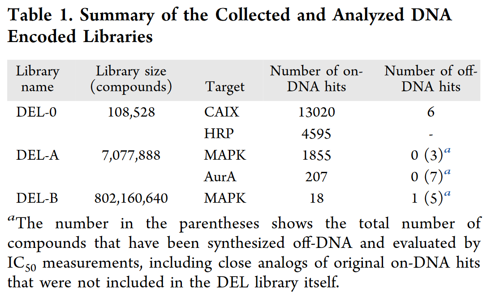

## 前言

:::tip
准备工作 文献阅读器 `zetoro`，
[相关文献](https://pubs.acs.org/action/showCitFormats?doi=10.1021/acs.jcim.4c00803&ref=pdf)

## 摘要
研究当前的暴力破解或人工智能支持的 uHTVS 方法是否可以构成 DEL 筛查的计算替代方案

## 介绍
通常，将适当修饰的蛋白质靶标固定在固体支持物（例如链霉亲和素珠）上，然后与完整的 DEL 文库一起孵育。通过一系列的清洗步骤，大多数文库成员被从溶液中去除，只留下那些对蛋白质靶标具有高亲和力的成员，然后通过适当的洗脱程序将其回收。然后使用 PCR 解码这些命中化合物的 DNA 标签扩增和高通量 DNA 测序，然后通常通过脱 DNA 合成和/或正交 DNA 分析来验证最佳命中。
从我们在对实验高通量筛选 (HTS) 和 VS 的方法学比较开始，并通过使用不同大小的文库（从 105 到 108 种化合物）进行 DEL 筛选的三个案例研究向上发展

## 三个数据库的内容总结

# Enumeration and Preprocessing of the Libraries

### DEL-0 数据集

- **来源**：从 Gerry 等人的研究中提取（参考文献 35）。
- **数据获取**：从相关的补充材料中获取标记为 DEL 的化合物的 SMILES 字符串，并使用 Schrödinger 的 LigPrep 在 pH 7.4 下进行预处理。
- **化合物数量**：数据集由 8 个骨架、114 个位于位置 1 的构建块（BB1）和 119 个位于位置 2 的构建块（BB2）组成，共计 108,528 个化合物。
- **唯一化合物**：实际有 107,616 个唯一化合物，因为 BB2 中的 70 和 77 是相同的片段。但实验测量对这些条目显示了不同的值，因此我们分别处理了重复的化合物，尽管它们的对接评分相同。
- **目标蛋白结合评估**：针对碳酸酐酶 IX（CAIX）和辣根过氧化物酶（HRP），通过归一化倍数（Fn）进行评估。
- **命中化合物分类**：具有 Fn 大于或等于 1 的化合物被分别视为对 CAIX 或 HRP 的 On-DNA 命中物。
- **Off-DNA 命中物**：从出版物中收集，根据组成的构建块识别合成的化合物。

### DEL-A 数据集

- **来源**：从 Clark 等人的出版物中提取（参考文献 30）。
- **组成**：由三个构建块组成，每个有 192 个不同的分子，总计 7,077,888 个化合物。
- **枚举方法**：由于缺乏化合物标识符，使用 Marvin 软件（参考文献 37）进行枚举。
  - 将构建块导入 MarvinSketch（参考文献 38），移除保护基，设置连接原子，根据构建块位置构建 R-基团。
  - 使用 Marvin 的 cxcalc（参考文献 39）的 Markush 枚举批处理模式创建完整 DEL-A 库化合物的 SMILES 字符串。
- **预处理**：使用 LigPrep（参考文献 40）对枚举的化合物进行预处理，设置与 DEL 数据集描述的类似。
- **命中化合物**：具有实验读取计数值的 DEL-A 数据集化合物被视为命中物。
- **命中识别**：由于相关出版物的支持材料仅包含命中化合物的构建块信息，命中识别是通过重建原始化合物，然后使用 RDKit 软件包（参考文献 41）和 KNIME 平台（参考文献 42）进行识别。

### DEL-B 数据集

- **来源**：也从 Clark 等人的工作中提取（参考文献 30）。
- **组成**：每个化合物由四个构建块组成，分别是 Fmoc 保护的胺、双功能酸和两个不同组的胺，成员数分别为 192、32、340 和 384 个片段。
- **化合物数量**：这四个构建块构成了一个包含 802,160,640 个化合物的 DEL 库。
- **枚举方法**：使用与 DEL-A 部分描述的相同方法，使用 Marvin 软件进行枚举。
- **预处理**：由于 DEL-B 库中的化合物数量庞大，分子的预处理方式与 DEL-0 和 DEL-A 数据集不同。
- **命中化合物**：具有实验读取计数值的 DEL-B 数据集化合物被视为命中物。
- **命中识别**：命中识别方式与 DEL-A 部分描述的相同（见表 1）。

## 内容
### 超高通量虚拟筛选（uHTVS）的进展
随着计算能力的提高，虚拟筛选也逐渐成为探索化学空间的一种有效手段。文中提到的uHTVS工具包括GPU加速的AutoDock、深度学习模型驱动的Deep Docking、以及用于形状筛选的GPU版ROCS算法等。这些工具使得筛选数亿种化合物成为可能。

虚拟筛选的挑战：尽管uHTVS技术不断进步，但其计算成本依然很高，尤其是在筛选数据集较大的情况下。为了解决这一问题，近年来开发了几种基于逻辑层的工作流，如V-SYNTHES（通过分子片段组合进行筛选）和Deep Docking（用深度学习模型预测对接评分）。

### 虚拟筛选与DNA编码库的对比
作者分析了虚拟筛选与DNA编码库在方法论上的异同点，指出两者各有优劣。虽然虚拟筛选在筛选速度和灵活性上具有优势，但DELs在处理大规模化合物库方面仍然表现出色。

### 三个案例研究

DEL-0数据集：包含10万多个化合物，筛选目标为过氧化物酶（HRP）和碳酸酐酶IX（CAIX）。通过对这些化合物进行虚拟筛选，作者比较了不同对接算法（如AutoDockGPU、Glide）在恢复DEL筛选命中率方面的表现。

DEL-A数据集：包含700多万个化合物，针对Aurora A激酶（AurA）和MAPK蛋白的筛选。该数据集规模较大，作者使用了Glide HTVS对其进行对接，并通过Deep Docking流程进行AI辅助筛选。

DEL-B数据集：包含8亿多种化合物，是最大的筛选数据集。由于数据量过大，无法进行暴力对接，作者仅使用了AI辅助工作流进行筛选，重点分析了Deep Docking的效果。

性能评估：作者通过接收者操作特性（ROC）曲线和富集因子（EF）评估了虚拟筛选的效果，结果表明，虽然Deep Docking能够有效筛选化合物，但其性能依赖于对接算法的质量。

1. DEL-0 数据集
数据集简介：DEL-0 数据集是一个相对较小的DNA编码库，包含107,616种独特化合物。其分子结构由8种不同的骨架、114种N-端修饰元素以及118种Suzuki反应派生的元素组合而成。目标蛋白是过氧化物酶（HRP）和碳酸酐酶IX（CAIX），这两者都与生物催化、癌症治疗及细胞调控等相关。

筛选方法：在对DEL-0数据集进行筛选时，研究人员使用了不同的对接算法，包括：

Glide（SP单精度、HTVS高通量虚拟筛选、SPcon带位置约束）：这是一个商用的对接软件。
AutoDockGPU：一个开源的GPU加速对接软件。对CAIX的对接还采用了AutoDock4Zn，这是一种为锌金属蛋白优化的力场。
结果与分析：

对接性能：通过接收者操作特性（ROC）曲线评估不同对接方法的表现，Glide系列方法总体表现优于AutoDockGPU，尤其是在对CAIX和HRP进行对接时表现更好。然而，AutoDockGPU因其开源特性，依然是替代商用软件的一个重要选择。
时间要求：Glide的计算时间明显更长，因为它依赖CPU计算，而AutoDockGPU利用GPU加速。因此，在多核CPU环境下，Glide的HTVS模式在时间效率上表现更优异。
结果差异：有趣的是，虚拟筛选的对接评分与实验命中率之间没有显著的相关性。这表明某些构件在虚拟筛选中被高估，反映了虚拟筛选算法在处理DEL数据时存在噪声问题。
总的来说，DEL-0数据集的案例展示了uHTVS与DEL筛选相结合的潜力，但也揭示了虚拟筛选在噪声处理和命中率预测方面的挑战。

2. DEL-A 数据集
数据集简介：DEL-A 数据集包含7,077,888种化合物，目标蛋白包括Aurora A激酶（AurA）和p38丝裂原活化蛋白激酶（MAPK）。AurA在细胞分裂、肿瘤干细胞性和细胞迁移中起到关键作用，而MAPK则调控细胞对压力的反应，参与肿瘤发生等多种生物过程。

筛选方法：由于DEL-A数据集的规模较大，研究人员主要采用了Glide HTVS模式，并引入了Deep Docking（深度对接）这一AI辅助筛选流程。Deep Docking使用深度学习模型预测对接评分，从而减少需要进行实际对接的化合物数量。

结果与分析：

暴力对接与AI辅助筛选的比较：
使用Glide HTVS对整个DEL-A数据集进行暴力对接得出的ROC曲线表明，虽然对AurA的筛选表现良好（部分曲线达到了预期的命中率），但对MAPK的筛选表现较差。尤其是在前1,000个评分最高的化合物中，MAPK几乎没有命中。
Deep Docking结合了Glide HTVS和AutoDockGPU的深度学习模型，用更少的化合物进行了对接。对于AurA，AI辅助筛选恢复了84.1%的实验命中，但对于MAPK的恢复率较低，仅为27.1%。
AI模型的性能差异：Deep Docking的性能依赖于所用的对接引擎。在使用AutoDockGPU时，很多化合物未能成功对接，这影响了ML模型的表现，导致命中率较低。相反，Glide HTVS的筛选结果更好，特别是对AurA的命中率较高。
该案例展示了AI辅助工作流的潜力，同时也表明，在更大规模的化合物库筛选中，暴力对接虽然耗时，但仍具有优势，特别是在AI模型预测不够准确时。

3. DEL-B 数据集
数据集简介：DEL-B数据集是最大的一个案例，包含802,160,640种化合物，目标蛋白为MAPK。由于该数据集的规模庞大，研究人员无法进行暴力对接，而是完全依赖于AI辅助筛选工作流（Deep Docking与Glide HTVS结合）。

筛选方法：与DEL-A相似，研究人员使用Deep Docking对DEL-B数据集进行筛选。该流程从库中随机抽取1.6%的化合物进行训练，然后利用深度学习模型预测剩余化合物的对接评分。

结果与分析：

命中率恢复：尽管Deep Docking标记了1.8百万个潜在命中化合物，但实际恢复的实验命中率仅为77.8%。尽管筛选出了部分符合预期的化合物，但许多命中化合物在筛选过程中未被成功识别。
性能评价：与随机抽样进行的比较表明，Deep Docking工作流在MAPK的筛选上具有一定优势，尤其是在前1%的化合物中，富集因子（EF）达到了11.1。
该案例展示了AI辅助筛选在处理超大规模化合物库中的重要性，尽管其结果未能完全恢复所有实验命中，但其高效性使其在面对规模极大的化学空间时表现出潜力。

4. 构件分析
构件贡献的评估：在所有三个案例中，研究人员还对化合物的分子构件进行了分析，评估了不同构件在命中化合物中的重要性。通过计算构件在不同筛选命中化合物中的Pbind值，作者发现实验结果和虚拟筛选结果之间的差异较大。例如，某些在实验筛选中被认为重要的构件，在虚拟筛选中并未显示出相应的重要性。

构件分析表明，虚拟筛选结果中一些构件的重要性可能被夸大或低估，表明当前虚拟筛选算法在捕捉化学构件贡献方面仍存在不足。