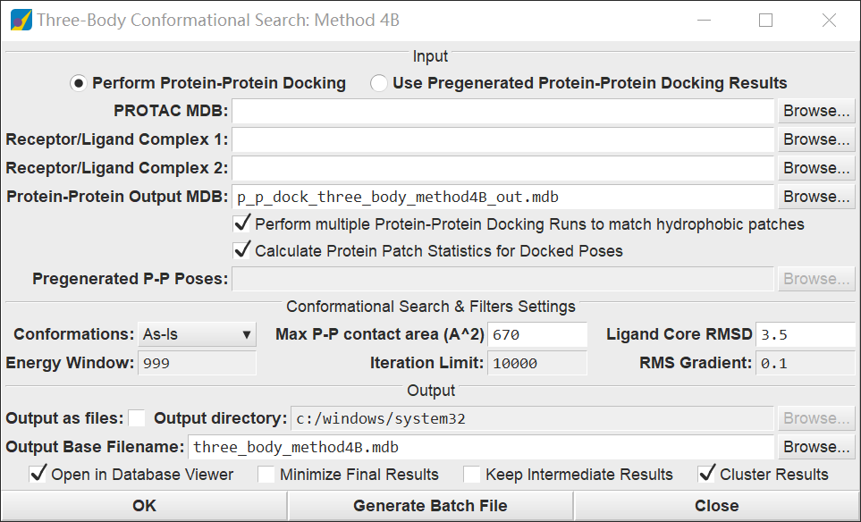

## 前言

:::tip
准备工作 protac两部分 `蛋白`，protac `分子`

:::

## 处理步骤

首先把protac的pdb下载下来之后，根据protac结合情况，将其分成两部分蛋白，然后单独把protac取出来

然后对新protac的除了linker的部分分别和两部分蛋白做对接

然后把对接后的两个结果及新的完整protac拿出来，一起对其进行method_4b

win版本的moe和linux的均可，linux的你需要准备两个method_4b，具体内容如下

(不要忘了处理过程中的能量最小化和蛋白结构优化的步骤)

```python 
#!/bin/sh
#if 0
$MOE/bin/moebatch -run $0 $*
exit
#endif
#svl

// Instructions: moebatch -load /home/tim/moedata/three_body_csearch_method4B.svl -run /home/tim/moedata/three_body_csearch_method4B_1.svl
function three_body_csearch_method4B;

local function main []
    three_body_csearch_method4B [rc1:'/home/tim/moedata/CDK4palpre.pdb', rc2:'/home/tim/moedata/E3VHLpre.pdb', inmdb:'/home/tim/moedata/protac_1.mdb', cmethod:'LowModeMD', dbout:'/home/tim/moedata/three_body_method4B_1.mdb', do_pp_out:'/home/tim/moedata/p_p_dock_three_body_method4B_out_1.mdb', cmethod:'LowModeMD', min_out:1,  dbvopen_out:0];
endfunction

```
## linux命令行如下
```bash
moebatch -load /home/tim/moedata/three_body_csearch_method4B.svl -run /home/tim/moedata/three_body_csearch_method4B_6.svl -mpu 40
```

图片参考 `method_4b`

