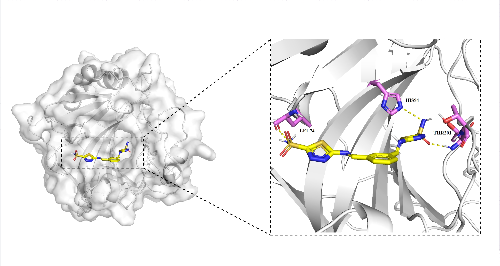
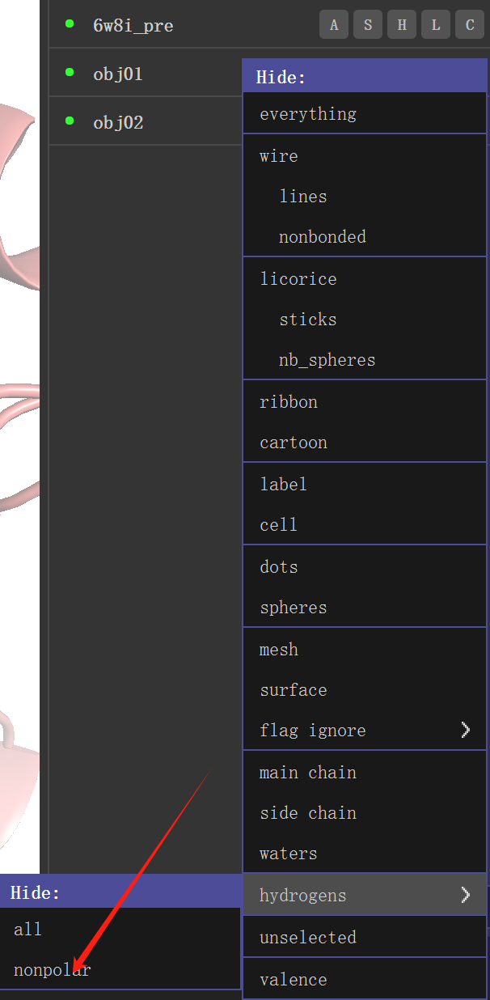

:::tip
准备工作 蛋白质 `pdb`，配体 `mol2`，画图软件 `pymol`
:::


# 前言
本文介绍了如何使用 PyMOL 绘制蛋白质的远景图和近景图，包括设置显示模式、调整颜色和参数，以及标记相互作用残基等步骤。

# 流程

## 远景图

```bash
# 加载蛋白质结构
load "E:/del/aaai/hanqun/smiles_picture/3p3h_protein.pdb", 3p3h_protein

# 加载配体结构
load "E:/del/aaai/hanqun/smiles_picture/docked_456.mol2", docked_456

# 复制蛋白质对象
create 3p3h_protein2, 3p3h_protein

# 一个设置为卡通模式
show cartoon, 3p3h_protein

# 另一个展示为表面
show surface, 3p3h_protein2

# 配体展示为棍状
show sticks, docked_456

# 调整颜色
# 蛋白改为浅色
color white, 3p3h_protein
color white, 3p3h_protein2

# 小分子（配体）改为黄色
color yellow, docked_456

# 设置参数
# 设置 cartoon_gap_cutoff 为 0
set cartoon_gap_cutoff, 0

# 调整表面透明度
set transparency, 0.5, 3p3h_protein2
set cartoon_transparency, 0.7, 6w8i_pre


# 设置背景为白色
bg_color white

# 使用花式螺旋
set cartoon_fancy_helices, 1

# 渲染和保存图像（可选）
# 渲染图像
ray 1000, 1000

# 保存图片
png "E:/del/aaai/hanqun/smiles_picture/distant_view.png", dpi=300


# 设置字体

set label_font_id, value
0：位图字体（默认字体，兼容性较好）
1：Sans（无衬线字体）
2：Serif（衬线字体）
3：Courier（等宽字体）

# 字体大小
set label_size, value


# 调整 sticks（棒状表示） 的粗细
set stick_radius, value
set stick_radius, 0.2

set stick_radius, 0.2, xx
set stick_radius, 0.2, site


```
# x-ray设置
```bash
Plugin - Lighting Settings - Xray

Draw/Ray 
    units 300
    reset
    without ray only 
```

## 近景图

```bash
# 选择残基
select residue_d88, chain D and resi 88
show sticks, residue_d88
select selected_residues, (chain D and resi 88 and resn D) or (chain D and resi 140 and resn N) 

select check_residue, chain D and resi 88
select selected_residues, (chain D and resi 88) or (chain D and resi 140)

select selected_residues, resi 430 and name LYS

select selected_residues, (resi 430 and name LYS) or (resi 314 and name ARG) or resi 312 or resi 481 or resi 477 or resi 475

create new_object, chain D and resi 140 and resn N


# 选择与配体4Å范围内的相互作用残基
select interacting_residues, (3p3h_protein within 4 of docked_456)

# 显示相互作用残基为棍状
show sticks, interacting_residues

# 计算并显示氢键和盐桥
# 计算并显示氢键（距离小于3.2Å）
distance hydrogen_bonds, (docked_456 and (name O+N)), (interacting_residues and (name O+N)), cutoff=3.2

# 计算并显示盐桥（距离小于4.0Å）
distance salt_bridges, (docked_456 and (resn ARG+LYS)), (3p3h_protein and (resn ASP+GLU)), cutoff=4.0

# 打开序列视图并显示序列编号
set seq_view, 1
set seq_view_label_mode, 1

# 标记相互作用残基的名称和编号
label interacting_residues, "%s%s" % (resn, resi)

# 去除渲染阴影
set ray_shadows, 0

# 字体设置
set label_font, 12
set label_size, 20

# 隐藏特定测量的标签（如有）
hide labels, measure03

# 制作选中原了的假原子
pseudoatom center 1,sele

# 新建链条
create chainABC, chain A or chain B or chain C

# 同时将his_center和ligand_center的球体大小设置为0.7
set sphere_scale, 0.7, his_center or ligand_center  

# 渲染图像
ray 1000, 1000

# 保存图片
png "E:/del/closeup_view.png", dpi=300
```
## 作图结果示例


## 不显示H原子sticks


# 蛋白分析
```bash
#对比蛋白
cealign 1，2

#配体1和其他相互作用
action-find-polar_contacts-to_other_atoms
```

## serein only
```bash
#蛋白染色
set_color custom_color1,[0.851, 0.867, 0.894]
color custom_color, 5fl4_protein2
#蛋白透明度
set transparency, 0.25, 5fl4_protein2

#配体染色
util.cba(36,"docked_1_1",_self=cmd)
#残基染色
util.cba(154,"obj02",_self=cmd)
```

