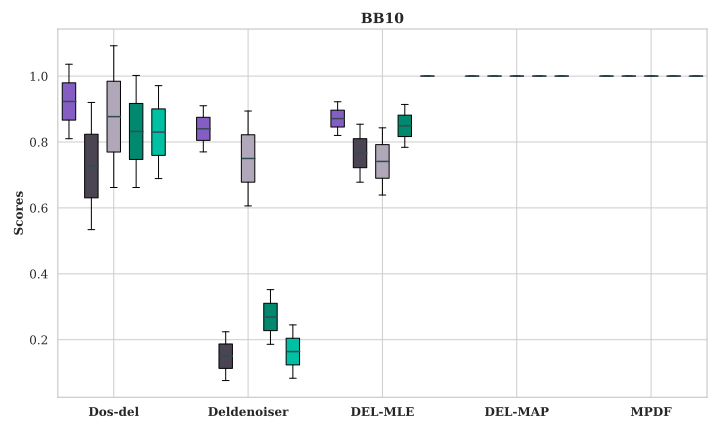
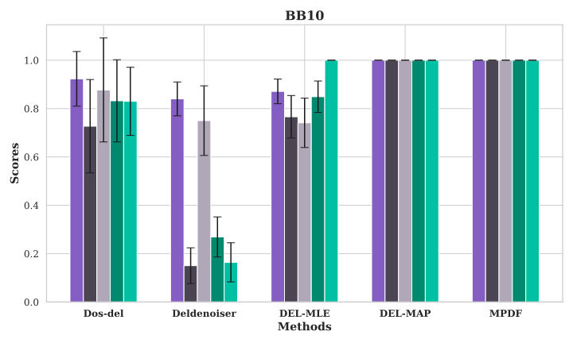

## 前言

:::tip
准备工作 论文 `数据`

:::

## 箱线图
```python 
#箱线图
import numpy as np
import matplotlib.pyplot as plt
from matplotlib.patches import Rectangle

# 初始数据：方法和指标
methods = ['Dos-del', 'Deldenoiser', 'DEL-MLE', 'DEL-MAP', 'MPDF']
metrics = ['AUROC', 'AUPRC', 'Recall', 'F1', 'Prec']

# 每个方法的均值和误差
means = [
    [0.923, 0.727, 0.877, 0.832, 0.830],  # Dos-del
    [0.840, 0.150, 0.750, 0.269, 0.164],  # Deldenoiser
    [0.871, 0.766, 0.741, 0.849, 1.000],  # DEL-MLE
    [1.000, 1.000, 1.000, 1.000, 1.000],  # DEL-MAP
    [1.000, 1.000, 1.000, 1.000, 1.000],  # MPDF
]

errors = [
    [0.113, 0.193, 0.215, 0.170, 0.141],  # Dos-del
    [0.070, 0.074, 0.144, 0.083, 0.081],  # Deldenoiser
    [0.051, 0.088, 0.102, 0.065, 0.000],  # DEL-MLE
    [0.000, 0.000, 0.000, 0.000, 0.000],  # DEL-MAP
    [0.000, 0.000, 0.000, 0.000, 0.000],  # MPDF
]

# 设置每个结果的颜色
colors = ['#845ec2', '#4b4453', '#b0a8b9', '#00896f', '#00c0a3']

# 创建箱线图
fig, ax = plt.subplots(figsize=(10, 6))

# 计算每种方法在x轴上的位置
num_metrics = len(metrics)
positions = np.arange(len(methods)) * (num_metrics + 1)  # 为每种方法分配x轴上的空间

# 为每种方法生成箱线图，每个方法内部的五个结果使用不同颜色
for i, method_means in enumerate(means):
    boxplot_data = []
    for j in range(num_metrics):
        lower_bound = method_means[j] - errors[i][j]
        upper_bound = method_means[j] + errors[i][j]
        # 创建数据
        boxplot_data.append([lower_bound, method_means[j], upper_bound])
    
    # 绘制箱线图，每个指标分配不同的颜色
    bp = ax.boxplot(boxplot_data, positions=positions[i] + np.arange(num_metrics), patch_artist=True, widths=0.6)
    
    # 为每个箱体设置颜色
    for patch, color in zip(bp['boxes'], colors):
        patch.set_facecolor(color)

    # 修改中值线的颜色和长度
    for median in bp['medians']:
        median.set_color('#334a52')  # 修改中值线的颜色
        median.set_linewidth(1.5)  # 保持中值线的粗细
        median.set_xdata([median.get_xdata()[0] + 0.05, median.get_xdata()[1] - 0])  # 确保中值线不会突出

# 设置x轴标签
ax.set_xticks([p + (num_metrics / 2) - 0.5 for p in positions])  # 调整x轴标签的位置
ax.set_xticklabels(methods, fontsize=12, fontweight='bold')

# 设置y轴标签
ax.set_ylabel('Scores', fontsize=12, fontweight='bold')

# 设置标题
ax.set_title('BB10', fontsize=14, fontweight='bold')

# 设置轴刻度标签加粗
ax.tick_params(axis='both', labelsize=12, width=2)

# 保存箱线图为SVG文件
fig.tight_layout()
plt.savefig('/home/tim/hmt/del_picture/误差图/database/箱线图.svg', format='svg')

# 显示箱线图
plt.show()

# 创建图例图
fig_legend, ax_legend = plt.subplots(figsize=(6, 3))

# 添加填充的长方形作为图例
handles = []
for color, metric in zip(colors, metrics):
    rect = Rectangle((0, 0), 1, 1, facecolor=color, edgecolor='black')  # 创建有边框的长方形
    handles.append(rect)

# 显示图例
ax_legend.legend(handles=handles, labels=metrics, title="Metrics", title_fontsize=12, fontsize=10, loc="center", frameon=True, edgecolor='black')
ax_legend.axis('off')  # 隐藏坐标轴

# 保存图例为SVG文件
fig_legend.tight_layout()
plt.savefig('/home/tim/hmt/del_picture/误差图/database/箱线图图例.svg', format='svg')

# 显示图例
plt.show()
```

图片参考 `箱线图`



## 柱状图

```python 
# Import necessary libraries
import matplotlib.pyplot as plt
import numpy as np
import seaborn as sns
import os

# 数据准备
methods = ['Dos-del', 'Deldenoiser', 'DEL-MLE', 'DEL-MAP', 'MPDF']
metrics = ['AUROC', 'AUPRC', 'Recall', 'F1', 'Prec']

# 各方法的均值和误差
means_data = {
    "BB10": [
        [0.923, 0.727, 0.877, 0.832, 0.830],  # Dos-del
        [0.840, 0.150, 0.750, 0.269, 0.164],  # Deldenoiser
        [0.871, 0.766, 0.741, 0.849, 1.000],  # DEL-MLE
        [1.000, 1.000, 1.000, 1.000, 1.000],  # DEL-MAP
        [1.000, 1.000, 1.000, 1.000, 1.000],  # MPDF
    ],
    "BB20": [
        [0.946, 0.727, 0.909, 0.847, 0.794],  # Dos-del
        [0.808, 0.070, 0.718, 0.234, 0.333],  # Deldenoiser
        [0.863, 0.628, 0.735, 0.775, 0.847],  # DEL-MLE
        [0.936, 0.812, 0.875, 0.897, 0.921],  # DEL-MAP
        [0.999, 0.982, 1.000, 0.991, 0.982],  # MPDF
    ],
    "BB30": [
        [0.934, 0.782, 0.872, 0.882, 0.891],  # Dos-del
        [0.899, 0.202, 0.852, 0.367, 0.234],  # Deldenoiser
        [0.939, 0.878, 0.877, 0.932, 0.996],  # DEL-MLE
        [0.991, 0.815, 0.989, 0.899, 0.823],  # DEL-MAP
        [1.000, 0.989, 1.000, 0.995, 0.989],  # MPDF
    ],
    "BB40": [
        [0.950, 0.902, 0.900, 0.947, 0.967],  # Dos-del
        [0.884, 0.032, 0.755, 0.231, 0.221],  # Deldenoiser
        [0.970, 0.914, 0.941, 0.955, 0.997],  # DEL-MLE
        [0.997, 0.883, 0.998, 0.938, 0.885],  # DEL-MAP
        [0.999, 0.989, 0.998, 0.994, 0.991],  # MPDF
    ],
    "BB50": [
        [0.958, 0.914, 0.916, 0.954, 0.995],  # Dos-del
        [0.903, 0.200, 0.862, 0.361, 0.229],  # Deldenoiser
        [0.971, 0.814, 0.946, 0.900, 0.859],  # DEL-MLE
        [0.998, 0.845, 1.000, 0.916, 0.845],  # DEL-MAP
        [1.000, 0.996, 1.000, 0.998, 0.996],  # MPDF
    ]
}

errors = [
    [0.113, 0.193, 0.215, 0.170, 0.141],  # Dos-del
    [0.070, 0.074, 0.144, 0.083, 0.081],  # Deldenoiser
    [0.051, 0.088, 0.102, 0.065, 0.000],  # DEL-MLE
    [0.000, 0.000, 0.000, 0.000, 0.000],  # DEL-MAP
    [0.000, 0.000, 0.000, 0.000, 0.000],  # MPDF
]

# 设置每个指标的颜色
colors = ['#845ec2', '#4b4453', '#b0a8b9', '#00896f', '#00c0a3']  

# 使用 Seaborn 样式
sns.set(style="whitegrid")
plt.rc('font', family='DejaVu Serif')  # 设置字体为 DejaVu Serif

# 设置保存路径
save_path = 'bbb'
os.makedirs(save_path, exist_ok=True)

# 创建图表并保存为SVG
for bb_name, means in means_data.items():
    fig, ax = plt.subplots(figsize=(10, 6))

    # 设置每个方法的柱状图宽度
    bar_width = 0.08
    x_spacing = 0.6
    # 设置X轴位置
    index = np.arange(len(methods)) * x_spacing  # 通过乘以x_spacing来增加间距

    # 绘制柱状图，分别绘制AUROC, AUPRC, Recall, F1, Prec
    for i, (metric, color) in enumerate(zip(metrics, colors)):
        ax.bar(index + i * bar_width, [mean[i] for mean in means], bar_width,
               yerr=[error[i] for error in errors], label=metric, capsize=5, color=color)

    # 设置X轴、Y轴标签和标题，并加粗
    ax.set_xlabel('Methods', fontsize=14, fontweight='bold')  # X轴加粗
    ax.set_ylabel('Scores', fontsize=14, fontweight='bold')   # Y轴加粗
    ax.set_title(bb_name, fontsize=16, fontweight='bold')  # 标题加粗

    # 设置X轴和Y轴坐标字体为 DejaVu Serif，并加粗
    ax.set_xticks(index + bar_width * 2)
    ax.set_xticklabels(methods, fontsize=12, fontfamily='DejaVu Serif', fontweight='bold')
    ax.tick_params(axis='y', labelsize=12)

    # 设置图例
    #ax.legend()

    # 保存主图为SVG
    plt.tight_layout()
    plt.savefig(os.path.join(save_path, f'{bb_name}_plot_without_legend.svg'), format='svg')
    plt.show()

# 生成图例并单独保存为SVG
fig_legend, ax_legend = plt.subplots(figsize=(3, 3))
ax_legend.legend(handles=ax.get_legend_handles_labels()[0], 
                 labels=ax.get_legend_handles_labels()[1], 
                 loc='center')
ax_legend.axis('off')  # 隐藏坐标轴
plt.savefig(os.path.join(save_path, 'legend_plot.svg'), format='svg')
plt.show()
```


图片参考 `柱状图`

