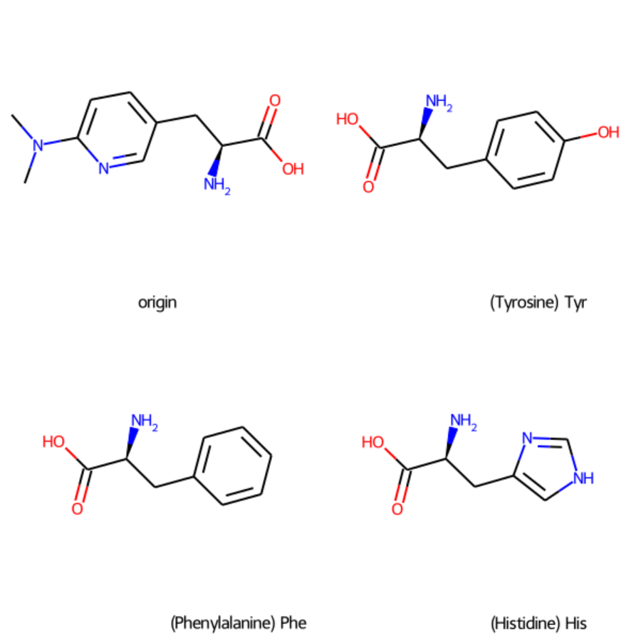

## 前言

:::tip
准备工作 分子 `smiles`\

:::
:::

## 
```python 
from rdkit import Chem
from rdkit.Chem import AllChem, DataStructs
from rdkit.Chem import Draw
from IPython.display import display

# 定义20种天然氨基酸信息
# 数据格式：单字母简写 : (英文全名, 三字母简写, 中文名称, SMILES)
amino_acids_info = {
    'A': ("Alanine",       "Ala", "丙氨酸",    "N[C@@H](C)C(=O)O"),
    'R': ("Arginine",      "Arg", "精氨酸",    "N[C@@H](CCCNC(N)=N)C(=O)O"),
    'N': ("Asparagine",    "Asn", "天冬酰胺",  "N[C@@H](CC(=O)N)C(=O)O"),
    'D': ("Aspartic Acid", "Asp", "天冬氨酸",  "N[C@@H](CC(=O)O)C(=O)O"),
    'C': ("Cysteine",      "Cys", "半胱氨酸",  "N[C@H](CS)C(=O)O"),
    'Q': ("Glutamine",     "Gln", "谷氨酰胺",  "N[C@@H](CCC(=O)N)C(=O)O"),
    'E': ("Glutamic Acid", "Glu", "谷氨酸",    "N[C@@H](CCC(=O)O)C(=O)O"),
    'G': ("Glycine",       "Gly", "甘氨酸",    "NCC(=O)O"),
    'H': ("Histidine",     "His", "组氨酸",    "N[C@@H](CC1=CNC=N1)C(=O)O"),
    'I': ("Isoleucine",    "Ile", "异亮氨酸",  "CC[C@H](C)[C@@H](N)C(=O)O"),
    'L': ("Leucine",       "Leu", "亮氨酸",    "N[C@@H](CC(C)C)C(=O)O"),
    'K': ("Lysine",        "Lys", "赖氨酸",    "N[C@@H](CCCCN)C(=O)O"),
    'M': ("Methionine",    "Met", "甲硫氨酸",  "N[C@@H](CCCSC)C(=O)O"),
    'F': ("Phenylalanine", "Phe", "苯丙氨酸",  "N[C@@H](CC1=CC=CC=C1)C(=O)O"),
    'P': ("Proline",       "Pro", "脯氨酸",    "N1[C@@H](CCC1)C(=O)O"),
    'S': ("Serine",        "Ser", "丝氨酸",    "N[C@@H](CO)C(=O)O"),
    'T': ("Threonine",     "Thr", "苏氨酸",    "N[C@@H](C(C)O)C(=O)O"),
    'W': ("Tryptophan",    "Trp", "色氨酸",    "N[C@@H](CC1=CNC2=CC=CC=C12)C(=O)O"),
    'Y': ("Tyrosine",      "Tyr", "酪氨酸",    "N[C@@H](CC1=CC=C(O)C=C1)C(=O)O"),
    'V': ("Valine",        "Val", "缬氨酸",    "N[C@@H](C(C)C)C(=O)O")
}

def print_compare_smiles(smiles_list, legends=None):
    """ 
    通用显示函数，可以接受一个包含4个SMILES的列表进行绘图比较。
    """
    mols = [Chem.MolFromSmiles(s) for s in smiles_list]
    if any(m is None for m in mols):
        print("无效的SMILES字符串存在")
        return
    
    for m in mols:
        AllChem.Compute2DCoords(m)
    
    if legends is None:
        legends = ['Mol1', 'Mol2', 'Mol3', 'Mol4']
    
    # 显示4个分子，2x2网格
    img = Draw.MolsToGridImage(
        mols,
        legends=legends,
        subImgSize=(300,300),
        molsPerRow=2,
        returnPNG=False
    )
    display(img)

def get_top3_similar_amino_acids(query_smiles):
    query_mol = Chem.MolFromSmiles(query_smiles)
    if query_mol is None:
        print("查询SMILES无效。")
        return None
    
    query_fp = AllChem.GetMorganFingerprintAsBitVect(query_mol, 2, nBits=1024)
    
    similarities = []
    for one_letter, info in amino_acids_info.items():
        name_en, name_3, name_cn, smiles = info
        aa_mol = Chem.MolFromSmiles(smiles)
        if aa_mol:
            aa_fp = AllChem.GetMorganFingerprintAsBitVect(aa_mol, 2, nBits=1024)
            sim = DataStructs.TanimotoSimilarity(query_fp, aa_fp)
            similarities.append((one_letter, name_en, name_3, name_cn, smiles, sim))
    
    # 根据相似度降序排序
    similarities.sort(key=lambda x: x[5], reverse=True)
    return similarities[:3]

# 使用示例
query_smiles = "CN(C)c1ccc(C[C@H](N)C(=O)O)cn1"
#query_smiles = "CC[C@@H](N[C@H](c1nc(C(=O)O)cs1)C(C)C)c1nnc([C@@H](N)Cc2ccccc2)o1"
#CC[C@@H](N[C@H](c1nc(C(=O)O)cs1)C(C)C)c1nnc([C@@H](N)Cc2ccccc2)o1

top3 = get_top3_similar_amino_acids(query_smiles)
if top3 and len(top3) == 3:
    print("与查询分子最相似的三个氨基酸及其相似度：")
    for i, t in enumerate(top3, start=1):
        one_letter, name_en, name_3, name_cn, smiles, sim = t
        print(f"排名{i}: {name_cn}({name_en}), 三字母:{name_3}, 单字母:{one_letter}, SMILES:{smiles}, 相似度={sim:.3f}")
    
    # legends中包含原始分子、以及top3氨基酸的标注，标注形式：中文名(英文名)三字母简写
    legends = ["origin"] + [f"{x[3]}({x[1]}) {x[2]}" for x in top3]
    smiles_to_show = [query_smiles] + [x[4] for x in top3]

    print_compare_smiles(smiles_to_show, legends=legends)


```


图片参考 `smiles`

