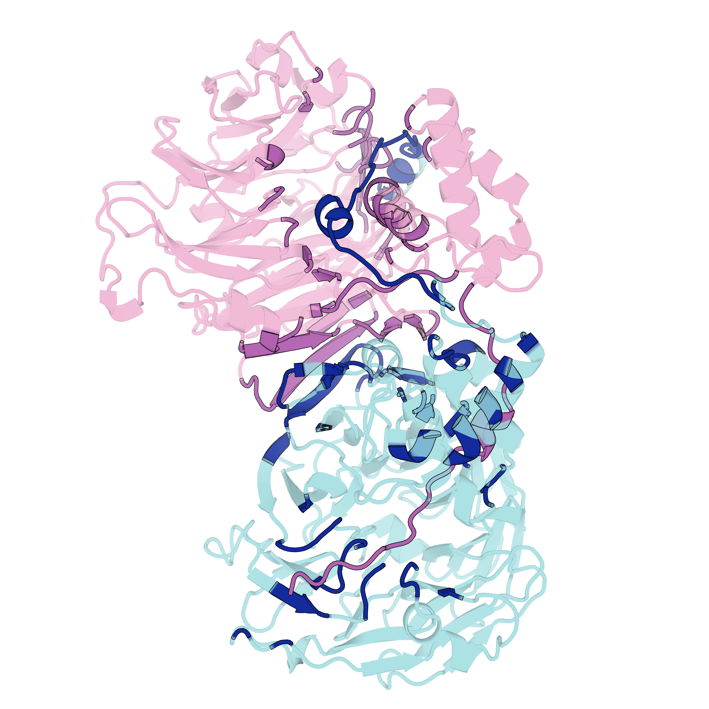
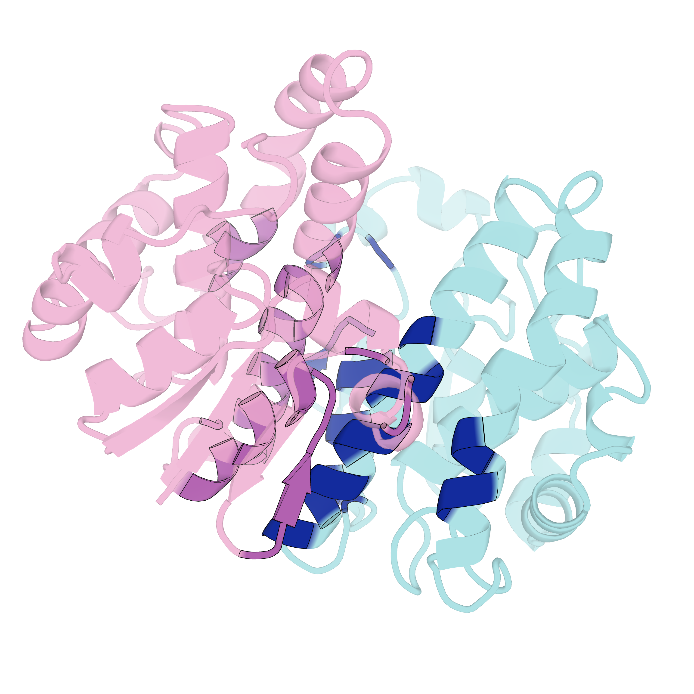
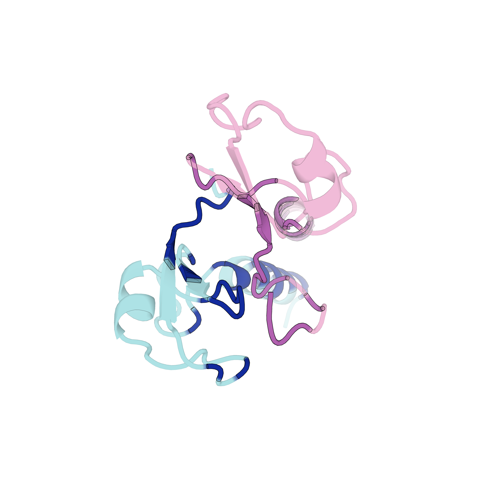
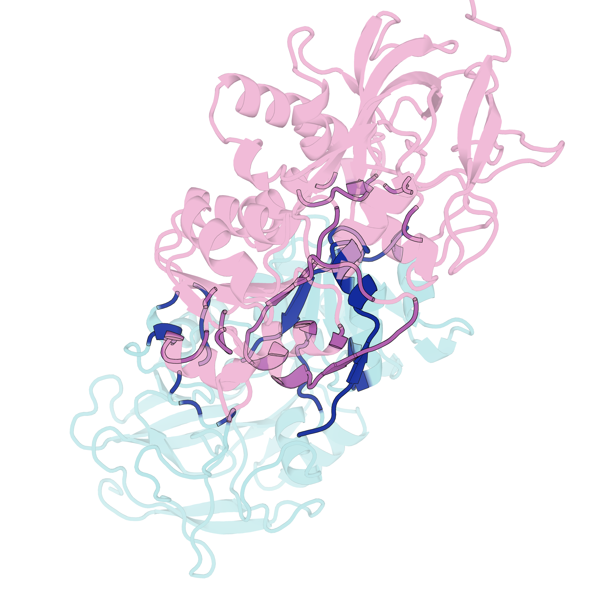

## 前言

在进行蛋白-蛋白相互作用（PPI）分析或复合物结构预测后，往往需要对大量的预测结果进行可视化。如果手动在 PyMOL 中逐个加载 PDB 文件并敲击选中、染色、调整透明度的命令，不仅耗时而且极易出错。

本文记录了如何编写一个 Python 脚本，根据 CSV 文件中记录的相互作用界面（Interface）信息，在 PyMOL 中批量、随机抽取目标结构，并自动完成高亮界面的规范化出图。

:::tip
准备工作 `包含 PyMOL 脚本命令的 CSV 数据表`，`对应的蛋白复合物 PDB 结构库`，`PyMOL 运行环境`\
相关核心点: [解决 Interface 搜索] | [精准控制特定链与界面的颜色及透明度]
:::
## Interface搜索
```python 
import os
import glob
import tempfile
import pandas as pd
import freesasa
from Bio.PDB import MMCIFParser, NeighborSearch, Selection, PDBIO, Select

class ChainSelect(Select):
    def __init__(self, allowed_chain_ids):
        self.allowed_chain_ids = set(allowed_chain_ids)

    def accept_chain(self, chain):
        return chain.id in self.allowed_chain_ids
        
    def accept_residue(self, residue):
        # 过滤水分子，保留标准氨基酸
        if residue.id[0] == 'W':
            return 0
        return 1

def calc_sasa_for_chains(structure, chain_ids, probe_radius=1.4):
    """使用 FreeSASA 计算指定链集合的 SASA"""
    params = freesasa.Parameters({"probe-radius": probe_radius})
    io = PDBIO()
    io.set_structure(structure)

    # 存为临时的 pdb 文件供 FreeSASA 读取
    with tempfile.NamedTemporaryFile(suffix=".pdb", delete=False) as tmp:
        tmp_path = tmp.name

    try:
        try:
            # 遇到非常规残基时 PDBIO 可能会报警，此处进行保护
            io.save(tmp_path, ChainSelect(chain_ids))
        except Exception as e:
            pass
            
        fs_structure = freesasa.Structure(tmp_path)
        result = freesasa.calc(fs_structure, params)
        return result.totalArea()
    finally:
        if os.path.exists(tmp_path):
            os.remove(tmp_path)

def analyze_interface(cif_path, chain_a_id='A', chain_b_id='B', distance=5.0, probe_radius=1.4):
    parser = MMCIFParser(QUIET=True)
    try:
        structure = parser.get_structure('complex', cif_path)
    except Exception as e:
        return {"error": f"读取文件失败: {e}"}

    model = structure[0]
    try:
        chain_a = model[chain_a_id]
        chain_b = model[chain_b_id]
    except KeyError as e:
        return {"error": f"找不到指定的链 {e}"}

    # 1) 距离法提取界面残基用于 PyMOL
    atoms_a = Selection.unfold_entities(chain_a, 'A')
    atoms_b = Selection.unfold_entities(chain_b, 'A')

    ns_a = NeighborSearch(atoms_a)
    ns_b = NeighborSearch(atoms_b)

    interface_a = set()
    interface_b = set()

    for atom_a in atoms_a:
        if ns_b.search(atom_a.coord, distance):
            interface_a.add(atom_a.get_parent().id[1])

    for atom_b in atoms_b:
        if ns_a.search(atom_b.coord, distance):
            interface_b.add(atom_b.get_parent().id[1])

    seq_a = "+".join(str(res) for res in sorted(interface_a))
    seq_b = "+".join(str(res) for res in sorted(interface_b))

    pymol_cmd = (
        f"select interface_A, chain {chain_a_id} and resi {seq_a}; "
        f"select interface_B, chain {chain_b_id} and resi {seq_b}; "
        f"select interface_all, interface_A or interface_B"
    )

    # 2) BSA = SASA(A) + SASA(B) - SASA(complex)
    try:
        sasa_a = calc_sasa_for_chains(structure, [chain_a_id], probe_radius=probe_radius)
        sasa_b = calc_sasa_for_chains(structure, [chain_b_id], probe_radius=probe_radius)
        sasa_complex = calc_sasa_for_chains(structure, [chain_a_id, chain_b_id], probe_radius=probe_radius)
        bsa = sasa_a + sasa_b - sasa_complex
    except Exception as e:
        return {"error": f"SASA/BSA 计算失败: {e}"}

    # 3) 过滤标准 (BSA > 400 且 双方参与残基数 >= 10)
    pass_bsa = bsa > 400.0
    pass_residue_count = (len(interface_a) >= 10) and (len(interface_b) >= 10)
    pass_all = pass_bsa and pass_residue_count

    folder_name = os.path.basename(os.path.dirname(cif_path))

    return {
        "file_name": os.path.basename(cif_path),
        "folder": folder_name,
        "chain_A": chain_a_id,
        "chain_B": chain_b_id,
        "distance_threshold": distance,
        "probe_radius": probe_radius,
        "interface_A_residue_count": len(interface_a),
        "interface_B_residue_count": len(interface_b),
        "sasa_A": round(sasa_a, 3),
        "sasa_B": round(sasa_b, 3),
        "sasa_complex": round(sasa_complex, 3),
        "bsa": round(bsa, 3),
        "pass_bsa_gt_400": pass_bsa,
        "pass_interface_residue_ge_10": pass_residue_count,
        "pass_all_filters": pass_all,
        "pymol_script": pymol_cmd,
    }


def batch_process_interfaces(base_dir, output_csv, max_files=None, distance=5.0, probe_radius=1.4):
    results = []
    cif_files = glob.glob(os.path.join(base_dir, "**/*.cif"), recursive=True)

    print(f"找到 {len(cif_files)} 个 CIF 文件...")

    if max_files is not None:
        cif_files = cif_files[:max_files]
        print(f"测试模式开启：仅处理前 {max_files} 个文件")
    else:
        print("开始处理所有文件...")

    for idx, cif_path in enumerate(cif_files, start=1):
        folder_name = os.path.basename(os.path.dirname(cif_path))
        parts = folder_name.split('_')

        # 尝试从文件夹名称中推断链 ID，默认为 A 和 B
        chain_a, chain_b = 'A', 'B'
        if len(parts) >= 3 and parts[-1].isalpha() and len(parts[-1]) == 2:
            chain_a, chain_b = parts[-1][0], parts[-1][1]

        print(f"[{idx}/{len(cif_files)}] 处理: {folder_name}")
        res = analyze_interface(
            cif_path,
            chain_a_id=chain_a,
            chain_b_id=chain_b,
            distance=distance,
            probe_radius=probe_radius
        )

        if "error" in res:
            print(f"  -> 失败: {res['error']}")
            results.append({
                "file_name": os.path.basename(cif_path),
                "folder": folder_name,
                "error": res["error"],
            })
        else:
            print(f"  -> 成功: 计算得 BSA = {res['bsa']} Ų")
            results.append(res)

    df = pd.DataFrame(results)

    # 确保 pymol_script 放在 CSV 文件的最后一列，方便复制
    if not df.empty and "pymol_script" in df.columns:
        cols = df.columns.tolist()
        cols.remove("pymol_script")
        cols.append("pymol_script")
        df = df[cols]

    df.to_csv(output_csv, index=False, encoding='utf-8-sig')
    print(f"\n处理完成，共记录 {len(results)} 条数据，已保存到: {output_csv}")


# ==========================================
# 批量处理运行代码
# ==========================================
predictions_dir = xx
output_csv_path = "interface_metrics_clean_bsa_test.csv"

# 先小规模测试：仅处理前 5 个
batch_process_interfaces(
    predictions_dir,
    output_csv_path,
    max_files=300,
    distance=5.0,
    probe_radius=1.4
)


```
## 渲染逻辑优化：颜色与透明度控制

为了让相互作用的界面在图片中足够醒目，我们采用了以下渲染策略：
1. **隐藏 Sticks**：整体统一使用 Cartoon 卡通模型展示。
2. **基础染色**：Chain A 染成 `pink`，Chain B 染成 `cyan`。
3. **高亮 Interface**：Chain A 的界面氨基酸染成更深的 `magenta`，Chain B 的界面染成 `blue`。
4. **透明度剥离**：将非 Interface 区域的透明度设置为 20%（`0.2`），而 Interface 保持完全不透明（`0.0`），以此突出核心作用区域。

## 完整自动化脚本

以下是经过优化并加入“随机抽取 + 子集导出”功能的完整 Python 脚本：

```python 
import csv
import os
import random
import re
import time
import glob
from pymol import cmd

def _safe_name(text):
    return re.sub(r"[^0-9A-Za-z_]+", "_", text)

def _infer_pdb_id(file_name):
    if not file_name:
        return "UNK0"
    m = re.match(r"^([A-Za-z0-9]{4})", file_name)
    return m.group(1).upper() if m else "UNK0"

def _parse_pymol_script(script):
    if not script:
        return None
    m_a = re.search(r"select\s+interface_A\s*,\s*chain\s+([A-Za-z0-9])\s+and\s+resi\s+([^;]+)", script, re.IGNORECASE)
    m_b = re.search(r"select\s+interface_B\s*,\s*chain\s+([A-Za-z0-9])\s+and\s+resi\s+([^;]+)", script, re.IGNORECASE)
    if not (m_a and m_b):
        return None
    return m_a.group(1), m_a.group(2).strip(), m_b.group(1), m_b.group(2).strip()

def _choose_loaded_object(cmd, row):
    loaded = set(cmd.get_names("objects"))
    file_name = row.get("file_name", "")
    folder = row.get("folder", "")
    pdb_id = _infer_pdb_id(file_name)
    candidates = [f"prot_{pdb_id}", folder, os.path.splitext(file_name)[0] if file_name else "", pdb_id]
    for c in candidates:
        if c and c in loaded:
            return c
    return None

def _resolve_structure_path(row, structures_root_dir):
    file_name = row.get("file_name", "")
    folder = row.get("folder", "")
    
    if structures_root_dir and folder and file_name:
        p = os.path.join(structures_root_dir, folder, file_name)
        if os.path.exists(p): return p
    if structures_root_dir and file_name:
        p = os.path.join(structures_root_dir, file_name)
        if os.path.exists(p): return p
    if structures_root_dir and file_name:
        matches = glob.glob(os.path.join(structures_root_dir, "**", file_name), recursive=True)
        if matches: return matches[0]
    return None

def _get_or_load_object(cmd, row, structures_root_dir):
    obj_name = _choose_loaded_object(cmd, row)
    if obj_name: return obj_name, None

    structure_path = _resolve_structure_path(row, structures_root_dir)
    if not structure_path:
        return None, "未找到对应结构文件"

    file_name = row.get("file_name", "")
    folder = row.get("folder", "")
    pdb_id = _infer_pdb_id(file_name)
    load_name = _safe_name(f"prot_{pdb_id}_{folder or os.path.splitext(file_name)[0]}")

    try:
        cmd.load(structure_path, load_name)
        # 强制检查 PyMOL 中是否真正创建了该对象
        if load_name not in cmd.get_names("objects"):
            return None, f"PyMOL 解析文件失败 (可能文件为空或缺少后缀): {structure_path}"
        return load_name, None
    except Exception as e:
        return None, f"加载结构发生 Python 异常: {e}"

def run_random20_from_csv(
    csv_path,
    structures_root_dir,
    output_dir,
    n=20,
    seed=20260313,
    command_log_path=None,
    width=3000,
    height=3000,
    dpi=300,
):
    if command_log_path is None:
        command_log_path = os.path.join(output_dir, "random20_pymol_commands.txt")
    if not os.path.exists(output_dir):
        os.makedirs(output_dir)

    with open(csv_path, "r", encoding="utf-8-sig", newline="") as f:
        reader = csv.DictReader(f)
        fieldnames = reader.fieldnames
        rows = list(reader)

    valid_rows = [r for r in rows if (r.get("pymol_script") or "").strip()]
    if not valid_rows:
        raise ValueError("CSV 中没有可用的 pymol_script 列内容。")

    random.seed(seed)
    sample_size = min(n, len(valid_rows))
    picked = random.sample(valid_rows, sample_size)

    # 导出随机选中的子集供后续核对
    out_csv_path = os.path.join(output_dir, "random20_selected.csv")
    with open(out_csv_path, "w", encoding="utf-8-sig", newline="") as f:
        writer = csv.DictWriter(f, fieldnames=fieldnames)
        writer.writeheader()
        writer.writerows(picked)

    cmd.bg_color("white")
    cmd.set("ray_opaque_background", "on")

    log_lines = [
        f"CSV: {csv_path}",
        f"Selected Sub-CSV: {out_csv_path}",
        f"Sample size: {sample_size} (Random seed: {seed})",
        "=" * 80
    ]

    for i, row in enumerate(picked, start=1):
        file_name = row.get("file_name", "")
        folder = row.get("folder", "")
        script = row.get("pymol_script", "")

        obj_name, load_err = _get_or_load_object(cmd, row, structures_root_dir)
        if not obj_name:
            log_lines.append(f"[{i}] SKIP {file_name} | 原因: {load_err}")
            continue

        parsed = _parse_pymol_script(script)
        if not parsed:
            log_lines.append(f"[{i}] SKIP {file_name} | 原因: 无法解析 pymol_script")
            continue

        chain_a, resi_a, chain_b, resi_b = parsed
        tag = _safe_name(folder or file_name or f"item_{i}")

        sel_a = f"interface_A_{tag}"
        sel_b = f"interface_B_{tag}"
        sel_all = f"interface_all_{tag}"

        cmd.select(sel_a, f"{obj_name} and chain {chain_a} and resi {resi_a}")
        cmd.select(sel_b, f"{obj_name} and chain {chain_b} and resi {resi_b}")
        cmd.select(sel_all, f"{sel_a} or {sel_b}")

        # 出图风格设置
        cmd.disable("all")
        cmd.enable(obj_name)
        cmd.show("cartoon", obj_name)
        
        # 染色
        cmd.color("pink", f"{obj_name} and chain {chain_a}")
        cmd.color("cyan", f"{obj_name} and chain {chain_b}")
        cmd.color("magenta", sel_a) 
        cmd.color("blue", sel_b)
        
        # 透明度设置
        cmd.set("cartoon_transparency", 0.2, f"{obj_name} and not {sel_all}")
        cmd.set("cartoon_transparency", 0.0, sel_all)
        cmd.zoom(obj_name)

        pdb_id = _infer_pdb_id(file_name)
        out_png = os.path.join(output_dir, f"{i:02d}_{pdb_id}_{tag}.png")
        print(f"[{i}/{sample_size}] 渲染: {out_png}")
        cmd.png(out_png, width=width, height=height, dpi=dpi, ray=1)
        time.sleep(0.5)

        log_lines.extend([
            f"[{i}] file={file_name} object={obj_name}",
            f"select {sel_a}, {obj_name} and chain {chain_a} and resi {resi_a}",
            f"select {sel_b}, {obj_name} and chain {chain_b} and resi {resi_b}",
            f"select {sel_all}, {sel_a} or {sel_b}",
            "-"
        ])

    with open(command_log_path, "w", encoding="utf-8") as f:
        f.write("\n".join(log_lines))
```

在 PyMOL 的命令行中，可以通过如下包含嵌套 Python 块的 `.pml` 脚本一键调用执行：

```pymol
run C:/Users/86173/Desktop/MPU_phd/20260310Biodata/pymol_random20_from_csv.py
python
run_random20_from_csv(
    csv_path=r"C:\Users\86173\xx\interface_metrics_clean_bsa_test.csv",
    structures_root_dir=r"C:\Users\86173\xx\complex_predictions_pack.tar\complex_predictions_pack\complex_predictions\predictions",
    output_dir=r"C:\Users\86173\xx\interface",
    n=20,
    seed=20260313
)
python end
```

## 渲染效果展示

通过上述脚本，最终渲染导出了指定的高清图片及封面：

图片参考 `蛋白复合物 Interface 渲染效果`




